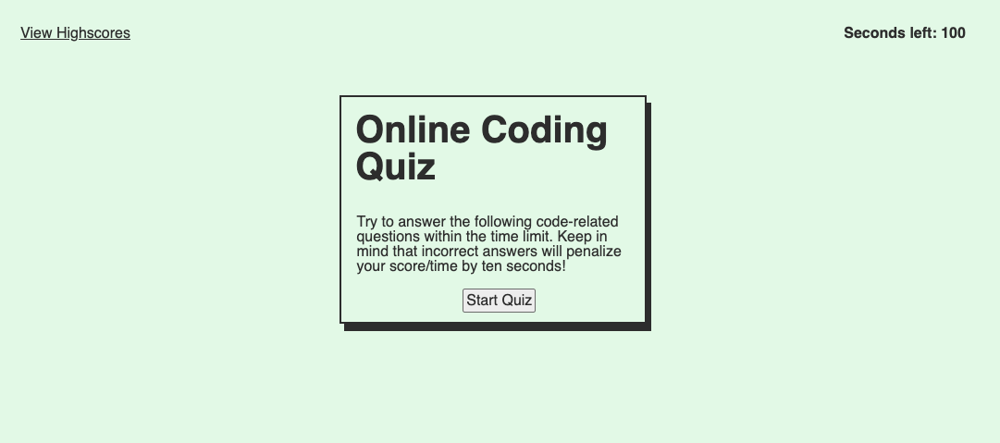
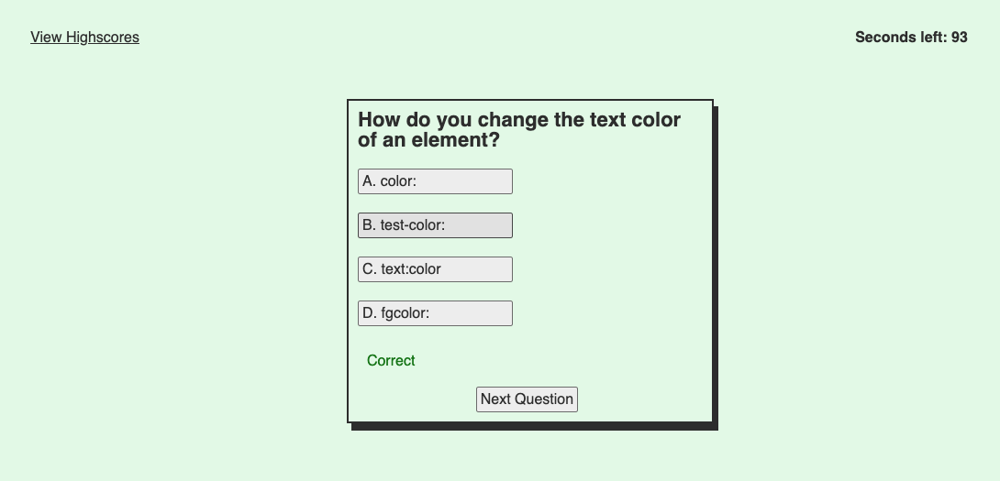
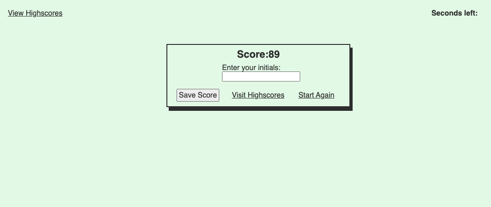

# <Online Coding Quiz>

## Description

The aim of this project was to create an online coding quiz using our skills in HTML, CSS & Javascript. The quiz was expected to feature some key elements such as; a timer that would be affected if the user's quiz answers were wrong and the users initials and score being stored to local storage and then displayed on the highscores page. 

This projected really highlighted javascript and it's potential; however, there are definite areas for improvement in my work if given more time. For example, this could be storing the questions on their own .js page and having them chosen at random using a javascript loop or correctly implementing the localStorage to record multiple user inputs and adjust according. 

This was a difficult assignment but I was happy that I was able to build it from scratch using skills gained throughout the course. 

## Usage

